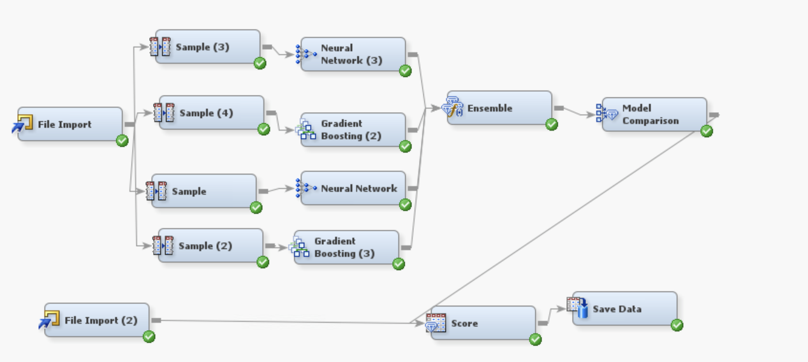

# Firm-Bankruptcy-Prediction

## Kaggle & PPT Slides
**Kaggle Leaderboard link**: [https://www.kaggle.com/competitions/fall-2023-mgmt571-final-project-on-classification/leaderboard?tab=public](https://www.kaggle.com/competitions/fall-2023-mgmt571-final-project-on-classification/leaderboard?tab=public) 

**Slides link**: [https://docs.google.com/presentation/d/1wszgR8M3PqwJW_ZoQk1x9CSUsV3gZ6U3/edit?usp=sharing&ouid=113313002084083777814&rtpof=true&sd=true](https://docs.google.com/presentation/d/1wszgR8M3PqwJW_ZoQk1x9CSUsV3gZ6U3/edit?usp=sharing&ouid=113313002084083777814&rtpof=true&sd=true)

### General Description
This project involves developing a predictive model using SAS Enterprise Miner (SAS EM) to forecast if a firm will file for bankruptcy. The project aims to predict firm bankruptcy by leveraging various econometric measures and data mining algorithms. The final model is an ensemble of Gradient Boosting and Neural Network models, designed to improve robustness and accuracy through data stratification and multiple sampling.

### Model Development
The predictive model was developed using the following steps:

1. **Data Preparation**:
   - The data was preprocessed and cleaned to ensure quality inputs for the modeling process.
   - A sample node was used to split the data multiple times, employing stratified sampling to increase robustness.

2. **Model Building**:
   - **Gradient Boosting**: This model was used to capture complex patterns in the data through iterative boosting.
   - **Neural Network**: This model was employed to leverage its ability to model nonlinear relationships.

3. **Ensemble Method**:
   - The final model is an ensemble of Gradient Boosting and Neural Network models. This approach was chosen to leverage the strengths of both models and provide more accurate predictions.

### Dataset
The dataset used in this project contains various financial and economic indicators that are used to predict the likelihood of firm bankruptcy. The data was sourced from a Kaggle competition specifically designed for this project.

### Outcomes
The final ensemble model provides the following outcomes:
- Enhanced prediction accuracy by combining the strengths of Gradient Boosting and Neural Network models.
- Increased robustness through stratified sampling and multiple data splits.
- A comprehensive analysis of the factors influencing firm bankruptcy.

### Conclusion
This project demonstrates the effective use of data mining algorithms in predicting firm bankruptcy. By combining Gradient Boosting and Neural Network models and employing robust data sampling techniques, the project achieves high prediction accuracy and provides valuable insights into the factors contributing to firm bankruptcy.

### Diagram
Here is the diagram of the ensemble model used in this project:

